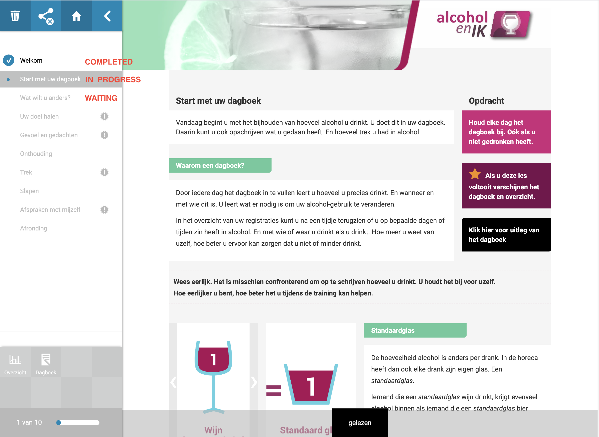
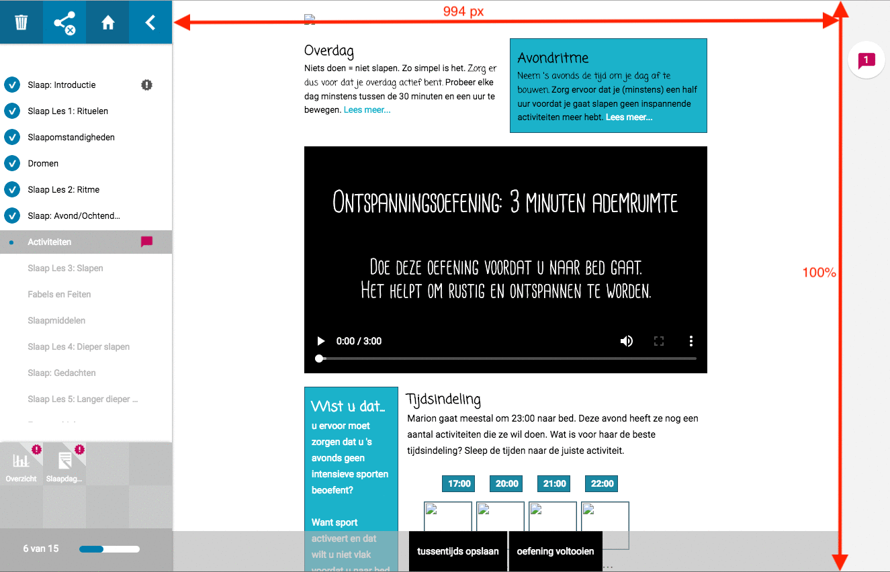
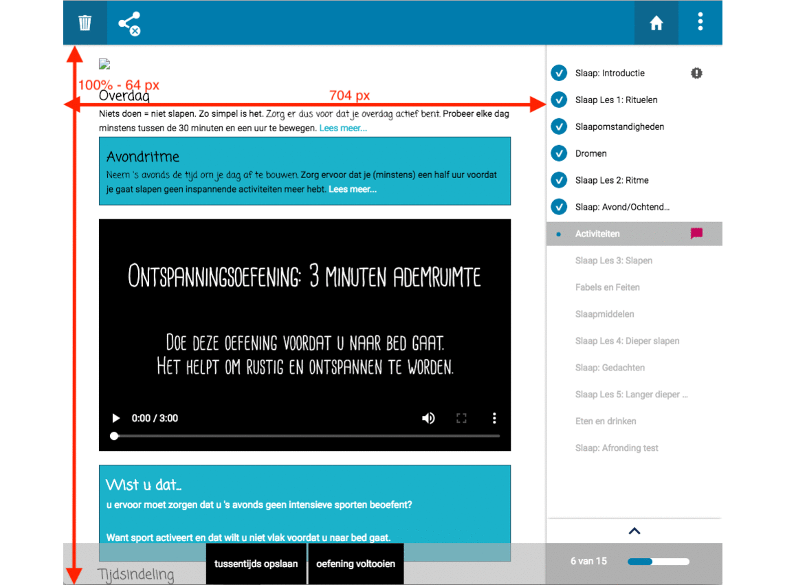

# Integratiedocument MijnAntes

Applicaties die functionaliteit bieden voor patiënten in het Koppeltaal domein, worden embedded weergegeven in Scheduler middels een iframe. Hierdoor kan een cliënt in een en dezelfde omgeving blijven voor het deelnemen aan verschillende taken en het zien van voortgang daarop. Koppeltaal zorgt hier voor de single sign on functionaliteit en de mogelijk om middels een standaardprotocol gegevens uit te wisselen. Gebruik zoveel mogelijk de laatst beschikbare versie van de adapter in jouw programmeertaal om er zeker van te zijn dat de berichtgeving binnen het domein eenduidig is.

## Koppeltaal domein integratie

Applicatie Koppeltaal ready maken: [https://www.koppeltaal.nl/aan-de-slag](https://www.koppeltaal.nl/aan-de-slag)

Ervan uitgaande dat de applicatie al om kan gaan met Koppeltaal berichten, wordt minimaal de volgende functionaliteit verwacht:

* Applicatie kan toetreden tot Koppeltaaldomein.
* Applicatie kan ActivityDefinition\(s\) publiceren van de content binnen het domein.
* Applicatie kan launch ontvangen via Koppeltaal

### Activiteiten launch

We onderscheiden 3 typen applicatie launches:

| Type | User identifier | Patient identifier |
| :--- | :--- | :--- |
| Cliënt | [https://antes.nl/Patient/12345](https://antes.nl/Patient/12345) | [https://antes.nl/Patient/12345](https://antes.nl/Patient/12345) |
| Behandelaar | [https://antes.nl/Practitioner/34567](https://antes.nl/Practitioner/34567) | [https://antes.nl/Patient/12345](https://antes.nl/Patient/12345) |
| Derde | [https://antes.nl/RelatedPerson/56789](https://antes.nl/RelatedPerson/56789) | [https://antes.nl/Patient/12345](https://antes.nl/Patient/12345) |

Merk hierbij op dat elke launch in de context van een cliënt \(`Patient` in Koppeltaal\) is en dat bij een cliënt launch de user identifier gelijk is aan de patient identifier.

Scheduler biedt de mogelijkheid aan behandelaren en derden om de activiteit van een cliënt te launchen om bijvoorbeeld voortgang te bekijken. Het is dus belangrijk dat de applicatie rekening houdt met het feit dat ook behandelaren een launch kunnen doen in de context van een cliënt. Wat dan vervolgens de mogelijkheden zijn binnen de applicatie, is aan de applicatie zelf \(e.g. een aparte view, read-only, toegang ontzeggen, etc\).

### Subactiviteiten

Ook biedt Scheduler de mogelijkheid voor het weergeven van subactiviteiten, indien aanwezig. Deze zullen dan worden weergegeven in de sidebar \(zie _afbeelding 1_\).

### Voortgang weergave

Scheduler geeft status weer op zowel subactiviteit- als activiteitsniveau. Hiervoor wordt het Koppeltaal berichttype _UpdateCarePlanActivityStatus_ uitgelezen wanneer deze in het domein worden verzonden door de applicatie. Zo hebben alle deelnemers aan het behandelplan \(`CarePlan`\) een duidelijk overzicht van de voortgang van activiteit. In totaal worden er vier statussen gevisualiseerd. Hieronder staat een overzicht met de statussen en welke applicatie geacht wordt deze status te zetten.

| Status | Beschrijving | Wie zet deze status? |
| :--- | :--- | :--- |
| WAITING | De content kan nog niet geopend worden | MijnAntes |
| AVAILABLE | De content kan geopend worden | MijnAntes |
| IN\_PROGRESS | De content is geopend | Externe Applicatie |
| COMPLETED | De content is afgerond | Externe Applicatie |

De statussen worden op de volgende manier getoond \(`AVAILABLE` wordt hier niet getoond maar is simpelweg niet greyed-out\):




## Applicatie launch vanuit Scheduler

Omdat content via een iframe wordt gepresenteerd, is het van belang dat een aantal zaken goed afgesteld staan. Onder andere X-Frame-Options en Third-party cookies.

### X-Frame-Options

Zorg ervoor dat uw applicatie geen headers meestuurt die ervoor zorgen dat Scheduler niet in een iframe getoond mag worden. Indien u toch restricties wilt meegeven voor het tonen van uw applicatie in een iframe, voeg dan de onderstaande headers toe.

```bash
Content-Security-Policy: frame-ancestors https://www.mijnantes.nl;
X-Frame-Options: allow-from https://www.mijnantes.nl
```

#### Toelichting

|  |  |
| :--- | :--- |
| _Content-Security-Policy: frame-ancestors_ | Verwijst naar domein\(en\) dat de applicatie mag tonen in iframe. Deze header overruled X-Frame-Options indien ondersteund. |
| _X-Frame-Options: allow-from_ | Zelfde als _frame-ancestors_, support voor Internet Explorer. |

### Third-party cookies

Safari en IE blokkeren standaard third-party cookies. Andere browsers bieden dit optioneel aan. De session cookie van de te integreren applicatie \(in het iframe\) is een third party cookie, vanuit Scheduler bezien. Hierdoor kan het gebeuren dat er niet wordt ingelogd op een Koppeltaal launch, omdat er geen session bekend is. Als de te integreren applicatie cookies nodig heeft, wordt de volgende aanpak gehanteerd.

Vanuit de te integreren applicatie verwachten wij het volgende:

    1. Een _GET_ request op de volgende URL:

```text
https://{HOSTNAME}/ensureCookie
```

    2. Dit request serveert de volgende HTML:

```markup
<!DOCTYPE html>
<html>
    <head>
        <title>Ensure Builder Cookie</title>
    </head>
    <body>
        <script>
            document.cookie = "safari_cookie_fix=fixed; path=/";
            location.href = document.referrer;
        </script>
    </body>
</html>
```

    3. De bovenstaande request dient uitgevoerd te kunnen worden zonder autorisatie.

### SameSite cookie

De `SameSite` setting van cookies wordt steeds breder geïmplementeerd. Deze setting geeft aan of een cookie meegestuurd mag worden naar andere domeinen. Het is dus een bescherming tegen CSRF aanvallen. Vanaf Chrome versie 80 wordt deze change langzaam uitgerold over de eindgebruikers. Zie [https://auth0.com/docs/sessions/concepts/cookie-attributes](https://auth0.com/docs/sessions/concepts/cookie-attributes) voor meer informatie.

De `SameSite` cookie moet toegevoegd worden bij het zetten van een session cookie. Belangrijk hierbij is dat de `SameSite` de waarde `None` heeft. Dit omdat vanuit MijnAntes de session cookie meegestuurd moet worden naar jullie server. Zie hieronder een voorbeeld van een valide Set-Cookie:

```
Set-Cookie: JSESSIONID=BABA9C0850F67E294FE084F1F059507A; Path=/; Secure; HttpOnly; SameSite=None; Secure
```

De setting `None` werkt enkel i.c.m. een `Secure` cookie. Houd er  rekening mee \(indien er lokaal over HTTP getest wordt\) dat de cookie lokaal waarschijnlijk niet gezet moet worden.

## Applicatie weergave in Scheduler

Scheduler biedt een desktop view \(applicatie breedte &gt; 960px\) en een mobile view \(applicatie breedte ≤ 960px\). De afmetingen van het content iframe is afhankelijk van de staat van de content sidebar: ingeklapt \(onzichtbaar\) en uitgeklapt \(zichtbaar\). Hierdoor wordt de breedte van het iframe en dus de maximale breedte van de content dus mede bepaald.

### Desktop

Op desktop resoluties zal de 'sidebar' standaard uitgeklapt zijn. Het content iframe heeft hier de volgende afmetingen.

* Sidebar uitgeklapt \(default\): maximaal 994 pixels breed.
* Sidebar ingeklapt: maximaal 1250 pixels breed.

De hoogte is altijd 100% van het venster.



### Mobile

Scheduler ondersteunt mobiele resoluties, de 'sidebar ' zal dan standaard ingeklapt zijn en neemt de volledige breedte van het scherm, tot een maximum van 960 pixels. Daarboven gelden de desktop afmetingen. Sidebar uitgeklapt: maximaal 704 pixels breed. Sidebar ingeklapt \(default\): maximaal 960 pixels breed.

De hoogte is altijd 100% van het venster minus 64 pixels voor de navigatie bar.



### Algehele stijl

Het is belangrijk dat de intergratie aanvoelt als één geheel. Aangezien de te integreren applicatie in ons iframe geladen wordt, is het van belang dat er een aantal componenten niet beschikbaar zijn in de te integreren applicatie:

* Geen logout knop
* Geen disclaimer/over ons/etc.
  * Algemeen disclaimer wordt in MijnAntes aangeboden. Deze is gemaakt door de Parnassia groep en is leidend voor alle geïntegreerde applicaties

## Content beschikbaar maken voor derden / naasten

MijnAntes ondersteunt de rol `RELATED_PERSON`. Niet elke applicatie ondersteunt deze rol. Graag aangeven wanneer dit het geval is. Op deze manier kunnen wij ervoor zorgen dat de content niet te delen is met derden / naasten.

